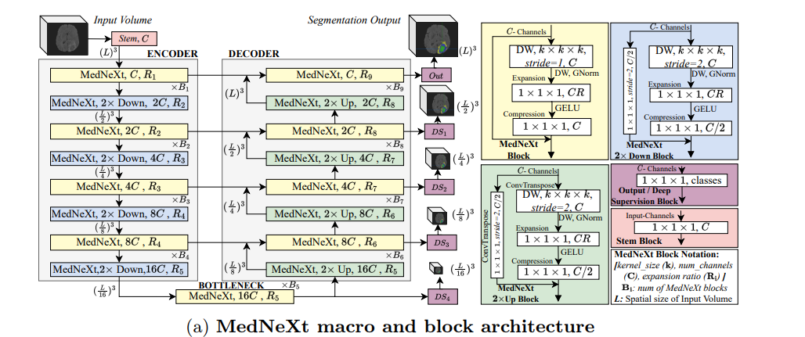

# MedNeXt
Here is my implementation of the MedNeXt described in the paper [MedNeXt: Transformer-driven Scaling of ConvNets for Medical Image Segmentation](https://arxiv.org/pdf/2303.09975.pdf) in pytorch

the structure of module is illustrated as following:

